아직 수정중

# 사회적 거리두기가 개인에게 미친 영향 분석 - 수정중

<br><br><br>

# 목차

<br>

1. [프로젝트 개요](https://www.notion.so/70dd37a33efa4908af95f0c72205b06a)
2. [프로세싱](https://www.notion.so/70dd37a33efa4908af95f0c72205b06a)
   1. [가설 1 : 인구 이동량과 사회적 거리두기는 서로 연관이 있을것이다.](https://www.notion.so/70dd37a33efa4908af95f0c72205b06a)
   2. [가설 2 : 인구이동량 (증감률)과 확진자수는 서로 연관이 있을까?](https://www.notion.so/70dd37a33efa4908af95f0c72205b06a)
   3. [가설 3 : 사람들은 코로나로 인해 일상의 많은 부분이 바뀌었다고 느낄것이다.](https://www.notion.so/70dd37a33efa4908af95f0c72205b06a)
   4. [가설 4 : 사람들은 코로나로 인해 달라진 자신의 경제상황에 대해 걱정할것이다.](https://www.notion.so/70dd37a33efa4908af95f0c72205b06a)
   5. [가설 4-1 : 코로나로 인해 부채가 증가하여 개인의 재정 상태가 악화되었을 것이다.](https://www.notion.so/70dd37a33efa4908af95f0c72205b06a)
   6. [가설 4-2  : 코로나로 인해 개인의 소비가 위축되었을 것이다.](https://www.notion.so/70dd37a33efa4908af95f0c72205b06a)
   7. [가설 5 : 거리두기 시행 이후 사람들의 정신건강도 악화되었을것이다.](https://www.notion.so/70dd37a33efa4908af95f0c72205b06a)
3. [프로젝트 후기 및 느낀점](https://www.notion.so/70dd37a33efa4908af95f0c72205b06a)

<br><br><br>

# 1. 프로젝트 개요

<br>

## 프로젝트 기획 배경 및 목표

- 프로젝트 주제: 사회적 거리두기가 개인에게 미친 영향
- 프로젝트 배경:  코로나로 인해 거리두기 정책을 시행하면서 개인의 삶이 많이 달라졌다고 느끼게 되어 어떤점들이 달라졌는지를 분석해보고싶어서 이 주제를 선택하게 되었습니다.

<br><br>

## 맡은 역할

가설 4-2 의 카드 총 매출액, 업종별 카드매출 분석 및 시각화 & `포트폴리오 내용 취합`

<br><br><br>

# 2.프로세싱

<br>

## 데이터 분석 및 시각화

<br><br>

<aside>
💡 가설1 : 인구 이동량과 사회적 거리두기는 서로 연관이 있을것이다.

<br>

### 데이터 수집

- 데이터 출처: 통계데이터센터의 통신모바일 인구이동량 통계 데이터
- 데이터 수집 & 데이터 분석 시스템 구축: `Colab Notebook`
- 시각화 툴: `Matplotlib`

<br>

### 분석결과

지역은 서울 및 광역시(부산, 대구, 인천, 광주, 대전, 울산)로 한정해서 분석을 진행했다.

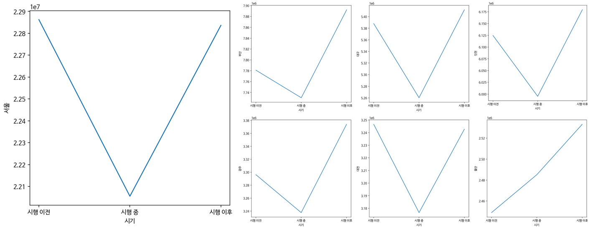

순서대로 서울. 윗줄이 부산, 대구, 인천. 두번째 줄이 광주, 대전, 울산.

<br><br>

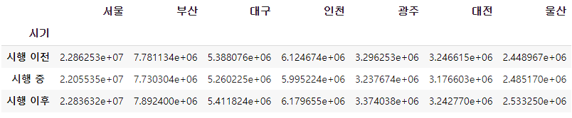

지역별 시행이전, 시행중, 시행이후를 나타낸 표

<br>

- **대부분의 그래프**가 **V형태**를 그리고 있는 것으로 보아 사회적 **거리두기 시행 및 해제는 이동량에 명확한 영향을 미쳤다**고 판단 가능하다.
- 울산의 경우 산업도시라 사회적 거리두기와 크게 연관이 없었을것으로 예상된다.
- 가설 검증: 가설과 일치한다.

<br><br>

각 지역의 전년도 대비 주별 증감률을 확인해보면 

<br>


7개 지역의 전년도 대비 주차별 인구이동량 증감률 그래프 (2020.01 1주차~ 2022.04 3주차)

<br>

- 2020.03 1주차: 대구 집단감염 및 사회적 거리두기 시행으로 인해 큰 감소율을 보이며, 특히 대구에서 최소치를 관측 가능.
- 2020.03 1주차: 대구 집단감염 및 사회적 거리두기 시행으로 인해 큰 감소율을 보이며, 특히 대구에서 최소치를 관측 가능.
- 2021.02 4주차: 비수도권 사회적 거리두기 완화가 2주차쯤 시행되었으며, 3주차를 넘어서 수도권까지 사회적 거리두기가 완화됨으로 인해 서서히 증가하여 4주차에 최고점을 찍은 것을 관찰가능
- 두 주차 사이의 **사회적 거리두기 시행 기간동안**에 평균적으로 **작년에 비해 이동량이 감소한 것을 확인**할수있다. 따라서 사회적 거리두기가 이동량 증감률과 연관이 있다고 판단할수있다.
- 가설 검증: 가설과 일부 일치하나, 예상 결과(사회적 거리두기 실시→ 이동량 확연히 감소, 해제→이동량 확연히 증가)와는 다른 특이점이 관측된다. ‘사회적 거리두기 실시→ 이동량 최저’ 까지는 가설과 일치하나 거리두기 해제가 아닌 완화시기에 이동량이 확연히 증가하였다.

<br><br><br>

<aside>
💡 가설2 : 그렇다면 인구이동량 (증감률)과 확진자수는 서로 연관이 있을까?

<br>

### 데이터 수집

- 데이터 출처
  - 통계데이터센터의 통신모바일 인구이동량 통계 데이터
  - 서울열린데이터광장의 서울시 코로나19 확진자 발생동향 데이터
- 데이터 수집 & 데이터 분석 시스템 구축: `Colab Notebook`
- 시각화 툴: `Matplotlib`

<br>

### 분석결과

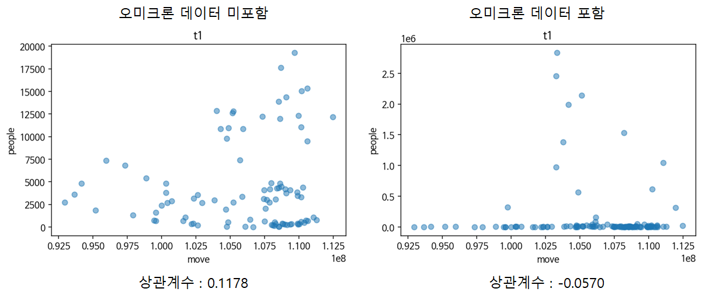

인구 이동량과 확진자수의 상관관계를 나타낸 산점도 그래프

<br><br>

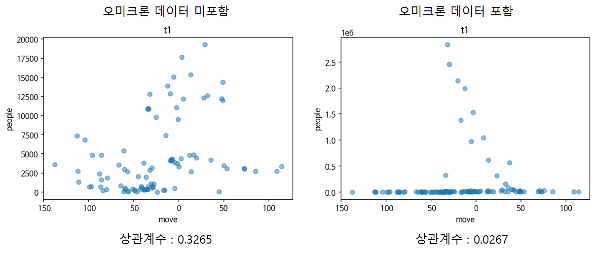

인구 이동량 증감률과 확진자수의 상관관계를 나타낸 산점도 그래프

<br>

- 오미크론 데이터를 포함하여 이동량(증감율) 데이터와 확진자 수의 데이터를 비교하여 상관계수를 계산해낸 결과, 굉장히 낮은 상관계수가 도출된다.
- 그러나, 오미크론 이후 확진자의 수는 이전까지의 데이터의 변화량을 무의미하게 만들 정도로 큰 데이터이며, 전염성은 높은 것에 비해 치사율과 낮고 증상이 비교적 약한 것을 감안하여 정부에서 사회적 거리두기 완화 등의 정책을 시행하여 데이터 분석을 오미크론 전으로 분석해야 한다고 판단된다.
- **오미크론 미포함 데이터로 비교 시**, 상관계수가 크게 증가했으나 ‘0.3265’의 상관계수는 낮은 수치이다. 따라서 **확진자 수와 이동량(증감율) 데이터 사이의 연관성은 낮다**고 판단 가능하다.
- 가설 검증: 가설이 틀림. 오미크론 이전 증감율과 확진자 사이에는 낮은 연관성이 존재하나, 그 외의 지표에서는 연관성이 존재하지 않는다고 판단 가능.

<br><br><br>

## 거리두기 이외에 개인의 삶에서 변화한 부분들

<br><br>

<aside>
💡 가설3 : 사람들은 코로나로 인해 일상의 많은 부분이 바뀌었다고 느낄것이다.

<br>

### 데이터 수집

- 데이터 출처: 한국노동패널조사 23차(2020년) 코로나 관련 부록 설문 중 코로나 19로 인한 생활 및 인식 변화 데이터
- 데이터 수집 & 데이터 분석 시스템 구축: `Colab Notebook`
- 시각화 툴: `Matplotlib` -bar plot

<br>

### 분석결과

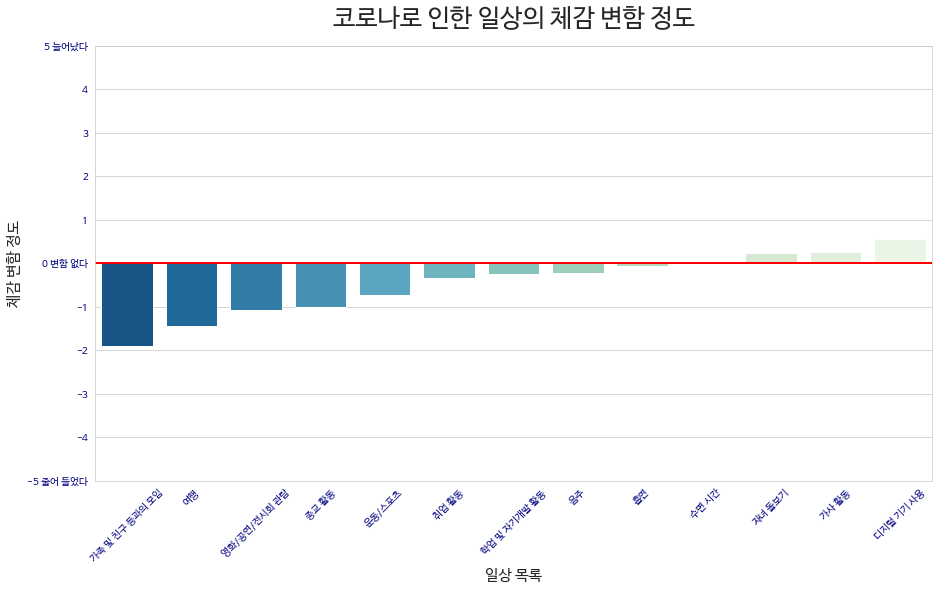

<br>

- 사람들은 **대부분의 일상 목록**에서 **변함을 체감**했다.
- 거리두기 정책의 영향으로 사람들과 접촉하거나 밖으로 나가는 가족이나 친구들과의 **모임, 여행 부분**이 **체감 변함정도가 가장 큰것을 확인**할수있다.
- 영화/공연/전시회 관람, 종교활동 등 외출이 필요하거나 타인과 만나는 것에 대해서는 코로나 이후에 줄었다고 느끼고 있다.
- 사람들은 집에서 하는 자녀 돌보기, 가사 활동, 장소에 구애받지 않는 디지털 기기 사용은 코로나 이후에 평소보다 늘어났다고 생각한다.
- 가설 검증 : 가설과 일치한다.

<br>

그렇다면 사람들은 당연하게 누렸던 일상들이 달라짐에 따라 어떤 부분을 얼마나 걱정할까?

<br><br><br>

<aside>
💡 가설4 : 사람들은 코로나로 인해 달라진 자신의 경제상황에 대해 걱정할것이다.

<br>

### 데이터 수집

- 데이터 출처: 한국노동패널조사 23차(2020년) 코로나 관련 부록 설문 중 코로나 19로 인한 생활 및 인식 변화 데이터
- 데이터 수집 & 데이터 분석 시스템 구축: `Colab Notebook`
- 시각화 툴: `Matplotlib` -bar plot

<br>

### 분석결과

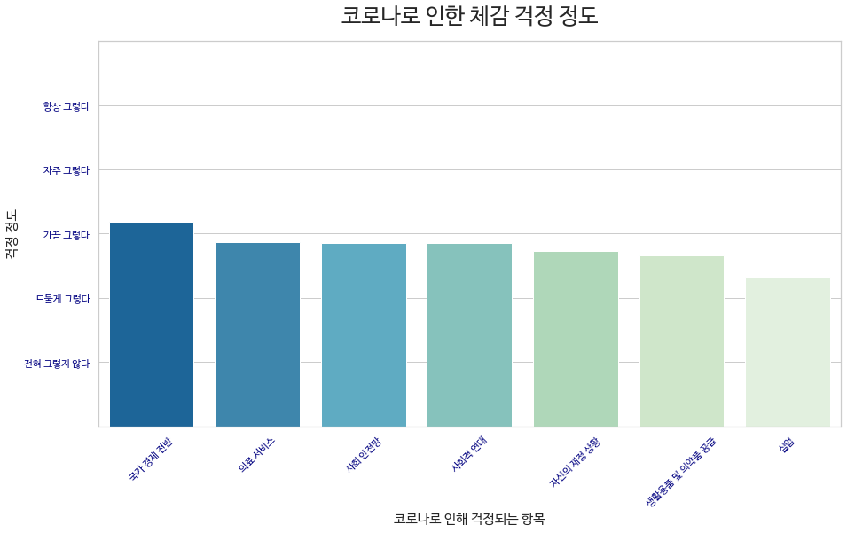

<br>

- 분석 결과 **사람들은 생각보다 그렇게까지 엄청 걱정하면서 살고 있지 않다는 것을 알 수 있다.**
- 그나마 국가 경제 전반에 대해 가장 크게 걱정하고, 자신의 재정 상황이나 실업 같은 개인적인 부분에서는 크게 걱정하지 않는 것으로 나타난다.
- 가설 검증 : 가설과 어느정도 일치한다. 걱정을 하긴하지만 엄청나게 걱정하지는 않는다.

<br>

그렇다면 국가 경제 전반에만 문제가 있고 개인의 재정 상황에는 문제가 없을까?

<br>

- 개인의 재정 상황에는 문제가 없을까? → 가설 4-1
- 사람들은 위축되지 않고 정상적으로 소비 생활을 하고 있는가? → 가설 4-2

<br><br><br>

<aside>
💡 가설 4-1 : 코로나로 인해 부채가 증가하여 개인의 재정 상태가 악화되었을 것이다.

<br>

### 데이터 수집

- 데이터 출처:
  - 한국은행경제통계시스템의 가구특성별 자산, 부채 데이터
  - 한국노동패널조사 가구데이터 중 개인 금융자산, 부채 데이터
  - 한국노동패널조사 22차, 23차 가구 데이터 설문 조사
- 데이터 수집 & 데이터 분석 시스템 구축: `Colab Notebook`
- 시각화 툴: `Matplotlib` -line plot, count plot, pie chart, bar plot

<br>

### 분석결과

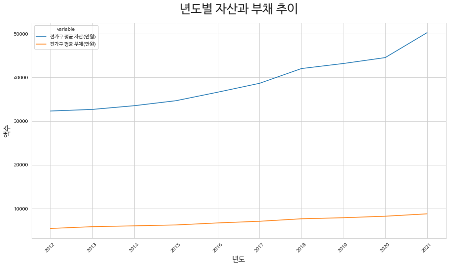

<br>

- 년도별로 **전체적인 흐름**을 봤을때 **부채 증가율이 자산 증가율보다 크지않다**.

<br><br>

부채 증가율만 세분화해서 보면

<br>

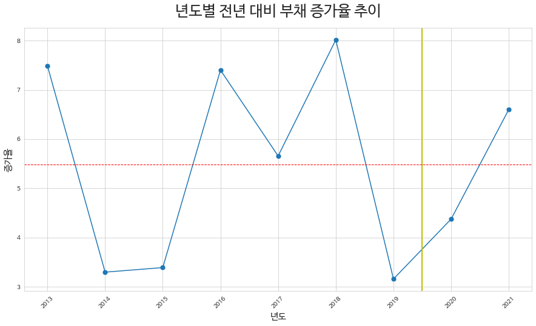

<br>

- 코로나의 영향을 받은 2020년 2021년 둘 다 전년 대비 부채 증가율이 다른 년도에 비해서 엄청 높은 편은 아니다.
- 지표상으로 보면 가계 부채가 코로나라는 특수 상황에도 불구하고 그렇게 크게 증가하지 않았기에 **코로나로 인해 개인의 재정 상태가 나빠졌다고 볼 수 없다**.
- 가설 검증 : 가설과 일치하지않는다.

<br><br>

부채를 진 이유를 확인해보면

<br>

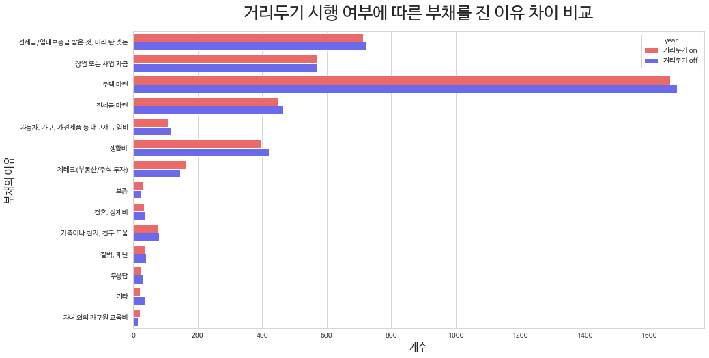

<br>

- 시각화를 했을 때 거리 두기 실행 여부에 따라 그나마 뚜렷한 차이를 보이는 부분은 생활비 부분이다.
- **생활비** 부분이 거리두기 시행 이전보다 시행 이후에 **줄어든 이유**는 **정부 지원금중 생활비 지원때문일것**으로 예상된다.
  - 부채가 있음에도 재정상황에 대해 크게 걱정하지 않는 이유는 생활비 지원때문일것으로 추측된다.

<br><br>

코로나 발생 이후 정부 지원금의 성격을 확인해보면

<br>

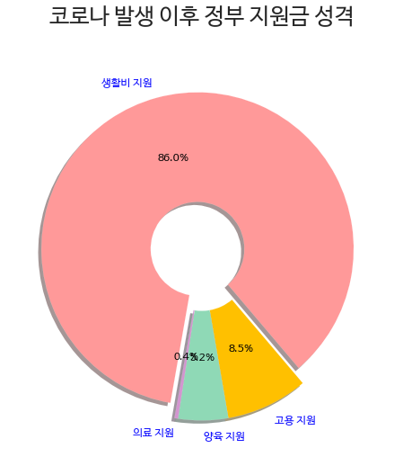

정부 지원금 성격별 비중

<br><br><br>

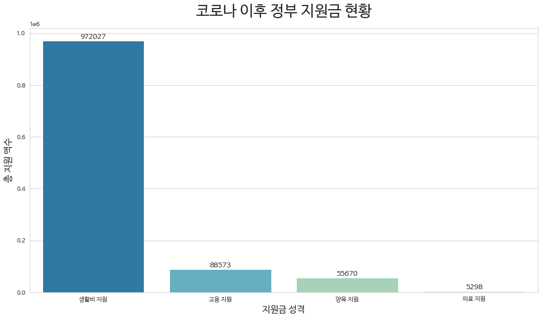

정부 지원금 성격별 지원금액

<br>

- 코로나 이후 지급된 정부 지원금 현황을 보면 개인이 **정부 지원금 중**에 **생활비 지원을 가장 많이 받은 것**을 알 수 있다.
  - 생활비 지원금이 재정 상황이 나아지는 것에 도움을 줬다는 사실을 알 수 있다.

<br><br><br>

<aside>
💡 가설 4-2 : 코로나로 인해 개인의 소비가 위축되었을 것이다.

<br>

### 데이터 수집

- 데이터 출처:
  - 한국은행경제통계시스템의 신용카드 전체 이용건수 데이터
  - 한국은행경제통계시스템의 뉴스심리지수 데이터
  - 한국은행경제통계시스템의 신용카드 지역별 월간 일평균 데이터(만원단위)
  - 한국은행경제통계시스템의 신용카드 지역별 월간 일평균 데이터(원단위)
  - KOSIS 국가통계포털의 온라인 쇼핑몰 거래액 데이터
- 데이터 수집 & 데이터 분석 시스템 구축: `Colab Notebook`
- 시각화 툴: `Matplotlib`

<br>

### 분석결과

거리두기 시행여부에 따른 월별 신용카드 이용금액

<br>

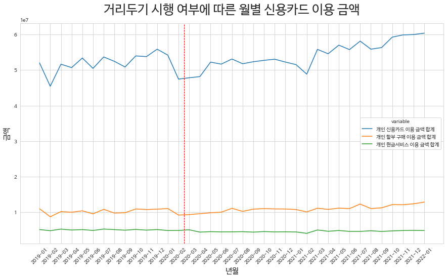

개인 신용카드 이용금액 합계, 개인할부구매 이용금액 합계, 개인 현금서비스 이용금액 합계

<br>

- **코로나 발생 이후 초반**에는 개인 신용카드 이용 금액이 **주춤**했지만, **그 이후**에는 **증가세**를 보이고 있다.
- 가설 검증 : 일부 일치한다.

<br>

그렇다면 신용카드 이용 금액과 경제 심리 지수, 뉴스 심리 지수 사이에는 상관이 있을까?

<br>

신용카드 이용금액과 경제심리지수, 뉴스심리지수의 상관관계를 확인해보면

<br><br>

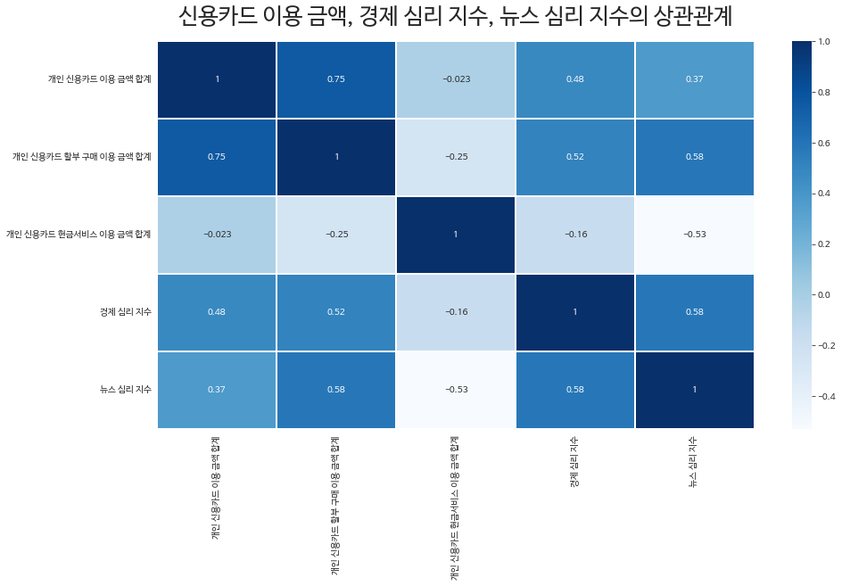

<br><br>

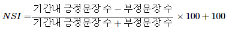

<br>

뉴스 심리지수 수치가 높을수록 경제에 대한 기대가 높은것

<br>

- **신용카드 이용 금액 합계**와 **경제 심리 지수**는 어느 정도의 **양의 상관관계가 있다**고 말할 수 있다.
- 신용카드 이용 금액 중 특히 **할부 구매 이용**과 **경제 심리 지수**가 **양의 상관관계가 강하다**는 사실을 알 수 있다.
- 경제적 사정이 좋아야지 할부 구매를 많이 이용하고 할부 구매를 많이 이용한다는 건 경제 사정이 나쁘지 않다는 것을 뜻한다.
- 신용카드 이용 금액 합계와 뉴스 심리 지수의 상관관계는 신용카드 이용 금액 합계와 경제 심리 지수 상관관계보다 약한 모습을 보여 주고 있는데,  뉴스 심리 지수가 실제 경제에 반영되기까지 2~3달이 걸리기 때문이다.

<br><br>

개인의 소비가 위축되었는지 자세히 확인해보기 위해 신용 카드 매출 데이터를 확인해본다.

<br><br>

### 총 카드 매출액 (지역, 업종 다 합해서 확인)


월별 총매출액 변화율 그래프 (매출액,만원단위)

<br>

- 월별 총매출액 변화율 그래프 (매출액,만원단위)에서 볼수있듯 **거리두기 첫 시행기간(2020-02-29~)**에 전국적으로 **매출액이 대폭 하락**했다. 표1에서 매출액 하위 1위를 차지할정도로 2020년 3월에 매출이 확 떨어졌다.

- 카드 매출액이 시간이 갈수록 높아지고 있다

- 21년 1월경 부터 21년 7월경 까지 매출회복세를 넘어 코로나가 없던 거리두기 이전보다 오히려 매출이 증가하는 추세를 보이나 싶더니 21년 8월경 매출이 갑자기 뚝 떨어졌다.

  - 21년 7월~ 21년 12월은 코로나 제4차 대유행 기간이였다. 첫 일일 확진자수 2,000~7,000명대를 돌파한 대유행시기(국내 대유행중 두번째로 큰 대유행 사태였음)였고 전국적으로 델타변이가 확산되었던 시기이다.
  - 연이어 일어나는 집단감염들과 자가격리 및  외출자제로 인해 전국적으로 매출이 감소한 현상으로 보여진다.

- 전체 매출 데이터중 **가장 높은 매출액**을 기록한 시기는 **21년 11월경**이다.

  - 제일 peak 를 찍은 2021-10 ~ 2021-11 월은 **상생소비지원금 시행기간**이였다. 그에따른 소비자들의 카드사용액 증가로 보여진다.
  - 상생소비지원금

  ```
  지역경제 활성화와 소비회복 촉진을 위해 신용 또는 체크카드를 2분기 월평균 사용액보다 3% 많이 쓰면, 3%를 넘는 증가분의 10%를 1인당 월 10만원까지 현금성 충전금으로 환급해 주는 사업
  ```

<br><br><br>

### 지역별 카드 매출액

**전체 지역**

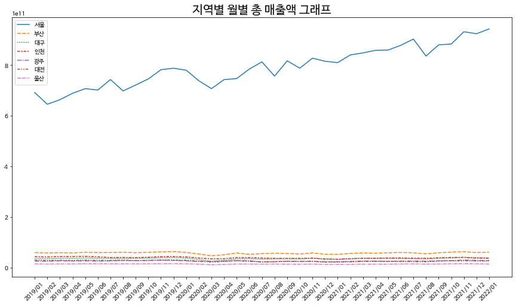

서울과 광역시에 해당하는 지역만 확인해본 그래프

<br><br>

**서울**

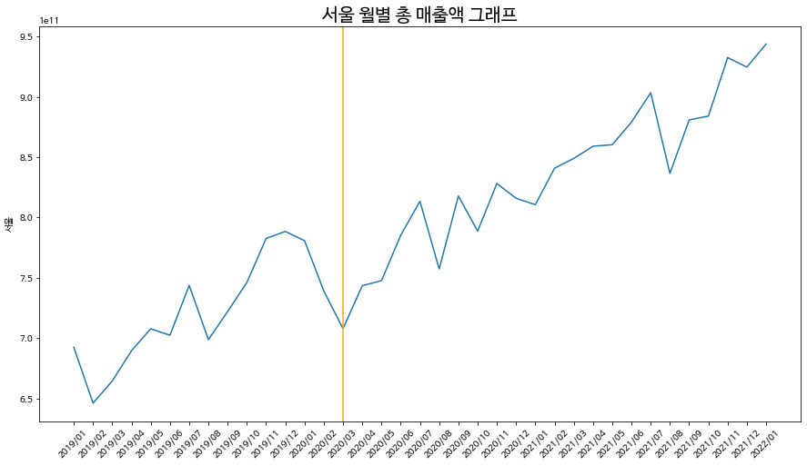

서울의 월별 총 매출액 그래프

<br>

- 사회적 거리두기가 시작된 **2020년 3월에 급감**
- 다음 달인 **2020년 4월 이후 다시 회복**하며 사회적 **거리두기 시행 전보다 매출액 증가**
- 전체적으로 우상향 그래프

<br><br>

**서울 외 지역**

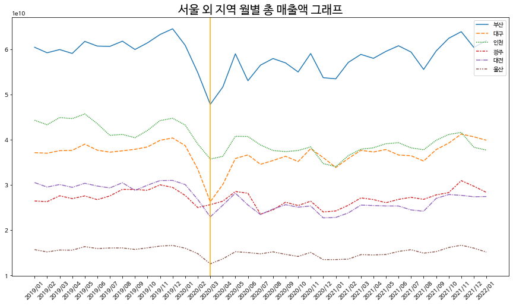

서울 외 지역들의 월별 총 매출액 그래프

<br>

- 사회적 거리두기가 시작된 **2020년 3월에 급감**
- 다음 달인 2020년 4월 이후 다시 증가하는 모습을 보이나, 대체로 **사회적 거리두기 전보다 매출액이 감소함**

<br><br>

### 업종별 카드 매출액

**큰 카테고리별로 확인**


업종별 신용카드 매출액 (매출액, 만원단위)

<br><br>

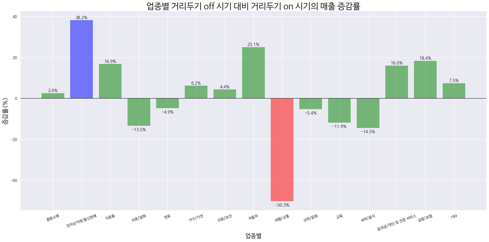

업종별 매출 증감률

<br>

- 거리두기 시행 후(on) 매출이 감소한 업종들 중에 **여행/ 교통 업종**의 **매출 감소율이 가장 크다**.

- **증가율이 제일 높은 업종**은 **전자상거래/ 통신판매**이다. 이것도 온라인(비대면) 배달주문 시스템이 확장됨에 따라 증가한것으로 보여진다.

  - 뉴스기사

    > 거리두기 강화에 온라인 장보기 급증…품절 속출

    > 코로나 재확산에 따른 사회적 거리 두기 강화로 외식 대신 온라인 식재료 쇼핑이 늘며 주요 온라인 쇼핑몰에서 식재료 품절이 반복되고 있습니다.

- 교육 업종의 매출 감소는 교육환경이 점점 온라인 교육으로 전환됨으로서 발생한 현상으로 보여진다.

  - 온라인 교육의 강의 결제비용은 전자상거래 업종으로 매출액이 들어간다.

- 의류/잡화 업종의 매출감소 역시 거리두기로 인해 발생한것으로 보인다

  - 자가격리나 거리두기 정책으로 인해 외출할 일이 적어지니 옷이나 화장품, 악세사리같은 필수 소비재가 아닌 업종에 대한 소비자의 지출이 감소한것으로 보여진다.

  - 거리두기로 인해 임금이 적어진 경우(실업자, 코로나 확진자로 인한 휴무 등등)  적어진 임금으로 생활해야하므로 생활 필수소비재에 해당하지않는 소비재에 대한 소비가 줄어들었을것으로 예상된다.

    > [뉴스기사] 서울대의 한 연구팀에 따르면 잠재 실업자를 포함하는 실업자의 28%가 코로나19로 실직하였고 41%가 경제적 위기를 경험하였고 48%가 극단적 선택을 고려하였다. 특히 자영업자의 피해가 심하다. 고용 회복세에도 자영업자는 1년 전 보다 불과 6만 명 늘어났다. 전체 취업자에서 자영업자가 차지하는 비중은 통계청 공식 통계에서 처음으로 20% 밑으로 떨어졌다. 늘어났다고는 하나 자영업자 수는 2020년 3월과 비교하면 줄어들었다. 직원을 둔 자영업자가 지난 해 11월까지 36개월 연속 감소하였다.

- 숙박/음식, 오락/문화, 여행/교통의 경우도 일상생활을 하는데 있어 꼭 필요하지않은 업종들 이기도하고 거리두기와 사적모임 금지로 인해 매출이 감소했을것으로 예상된다.

- **자동차 업종**의 **매출 증가**는 확진자와의 접촉에 대한 소비자들의 걱정, 두려움이 만들어낸 결과로 예상된다.

  - 많은 인원이 함께 이용해야하는 **대중교통 업종**은 여행/ 교통 카테고리에 포함되어있는데 여행/교통 카테고리의 평균 매출액은 off 시기와 비교했을때 **크게 감소**했고 그에 반해 자동차업종의 평균 매출액 증가율은 증가율 순위 2위를 차지할만큼 높다.

<br><br><br>

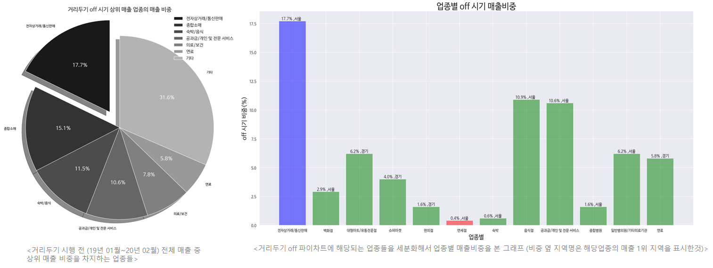

<br><br>

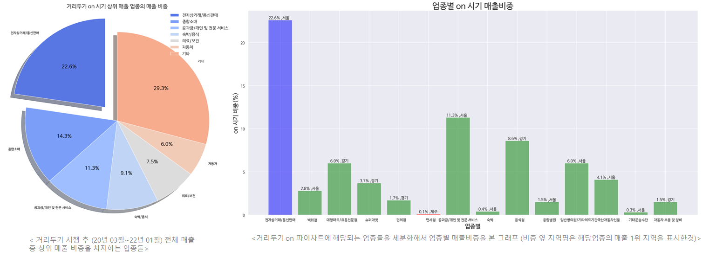

<br><br><br>

**작은 카테고리별로 확인**

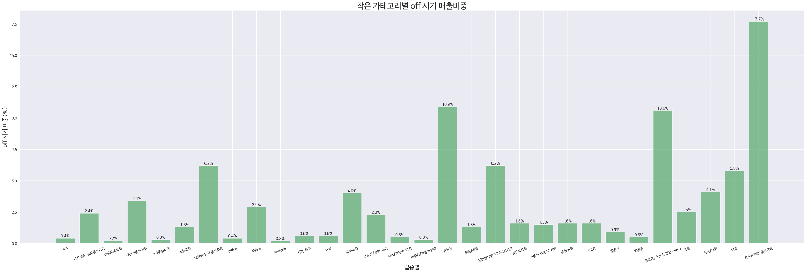

작은 카테고리 전체의 업종별 off 시기 매출비중 그래프

<br><br>

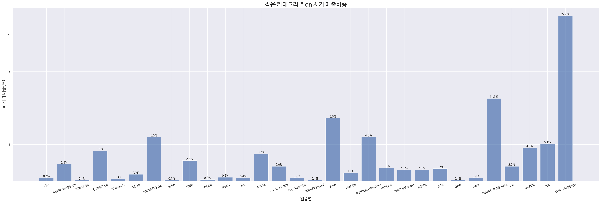

작은 카테고리 전체의 업종별 on 시기 매출비중 그래프

<br><br>


작은 카테고리별로 매출비중 변화정도를 나타낸 그래프 (on-off)

<br>

- 작은 카테고리별로 확인한 그래프에서 **매출비중이 가장 많이 감소**한 업종은 **‘음식점’** 이다.

- 일반병의원, 종합병원의 경우도 감소폭이 그렇게 크지는 않지만 감소했다.

  - 감기에 자주 걸려 병원을 1년에 3번이상은 방문하는 사람들도 코로나 유행으로 인해 마스크를 쓰다보니 감기에 잘 안걸리게 되어 병원 방문율이 줄었고 그로인한 매출 감소로 보여진다.

  > 코로나19 판데믹으로 인해 이비인후과가 경영상 큰 어려움을 겪게 됐다는 것. 코로나19 사태로 21년 4월 진료비 증감률은 이비인후과가 작년 동월 대비 46% 감소하였고 처방건수로는 60% 넘게 감소한 상태다.

  > 이비인후과 개원의 528명을 대상으로 실시한 설문조사 결과를 살펴보면, 작년 동월 대비 40-80%의 매출감소를 93%(491명)의 응답자가 응답했고 56%(295명)의 응답자는 내원환자 감소율이 60%가 넘어 심각한 경영상 어려움을 겪고 있다고 응답했다.

  > 출처 : 의약뉴스(http://www.newsmp.com)

  - 이비인후과 외에도 다른 병원들의 경우에도 코로나 백신접종을 위해 병원을 방문하는 사람이 많아 사람이 항상 몰려있어 꼭 병원을 가서 진료를 받아야하는 상황이 아니면 가급적 병원에 방문해 진료를 받는일이 줄어든것으로 보인다.
  - 비대면 진료의 경우 22년 03월경에 시행되기 시작했다. 데이터에는 22년 01월 까지만 있어 비대면 진료의 매출은 잡히지 않은것으로 보인다.

- **‘항공사’**의 경우 **매출 비중 감소 2위**를 차지한다.

- **‘국산자동차신품’** 업종은 거리두기 이전에 비해 **매출 비중**이 **0.7 상승**했다. (3.4%→4.1%)

- 가설 검증 : 일부는 일치함. 개인의 소비가 일부 위축된 업종들도 있지만 오히려 거리두기 이전보다 카드 매출이 더 증가한 업종도 많았다.

<br>

거리두기 on 과 거리두기 off 시기 전부 전자상거래 매출이 1위였으니 전자상거래 매출을 더 확인해보면

<br><br>

**월별 전자상거래 이용량 추세**


<br>

- 코로나가 처음 발생한 1월을 기준으로 소비가 위축되면서 온라인 및 오프라인에서 판매한 모든 상품 거래액은 감소하였으나, 온라인 쇼핑 거래액은 기존 수준을 유지한 것으로 나타남
- 코로나 발생 시기인 2020-01에는 28,092,797만원으로, 거리두기가 끝난 2022-01은(해당 데이터상 마지막 집계) 42,458,596만원으로  **51.1%성장률**을 보인다.

<br><br>

**거리두기 시행기간 (on) 일때와 거리두기 시행 이전(off) 의 전자상거래 이용량(매출액) 비교**

 


- 거리두기 시행 이전(off) 기간 시 전자상거래 이용량은 **26.1%의 상승세**를,
- 거리두기 시행 기간(on) 기간 시 전자상거래 이용량은 **45%의 상승세**를 보인다.

<br><br><br>

**거리두기 시행기간 (on) 일때와 거리두기 시행 이전(off) 의 전자상거래 매출액 상위업종**


<br>

- 온라인쇼핑 시장의 성장과 더불어 코로나와 사회적 거리두기의 영향으로 인한 상품군별 온라인쇼핑 상위 업종을 알아봄으로서, 개인의 소비에 어떠한 영향을 미쳤는지 알아보고자 한다.
- 거리두기OFF 때 가장 많이 소비한 업종인 여행 및 교통서비스는 거리두기ON시기에 크게 하락하였는데, 이는 이동 범위가 제한되며 해당 항목의 소비가 축소 되었다고 볼 수 있다.
  - 여행 및 교통서비스는 항공권, 교통티켓(버스·기차), 렌터카, 숙박시설 등을 포함

<br><br>


<br>

- 상품군별로 보면, 코로나19 발생 초기인 올해 1분기의 전년대비 거래액 증가율은 ‘음식서비스’가 전체 상품군 중 증가율이 가장 높았으며, 그 외에 ‘자동차 및 자동차용품’, ‘식품’, ‘생활용품’ 순으로 높게 증가한 것으로 나타난다.

  - 이는 식생활 라이프스타일의 큰 변화를 반영 하였는데 안전지향, 편의지향, 맛지향, 경제지향 요인이 개인의 삶에 영향을 미친 것으로 보인다.

- 거리두기 이후 음・식료품과 음식서비스의 온라인 이용이 크게 증가하였는데, 이는 이동량 제한으로 오프라인 생활 반경은 좁아졌지만, 온라인상에서의 생활 반경은 넓어졌음을 의미한다.

- 새벽배송, 당일배송 등 음・식료품을 신선하게 구매할 수 있는 e커머스 시장의 활성화 역시 해당 업종의 소비량을 증가시킨 원인이라 볼 수 있다.

  > 온라인 장보기 침투율은 2020년 21.3%에서 2023년 30%, 2025년 40%까지 확대될 것으로 추정된다. 실제 올해 10월 누적 온라인 식품 거래액은 전년 대비 29.5% 성장한 27조원을 기록했다. 정소연 연구원은 "침투율은 25.1%까지 상승해 온라인 식품의 성장은 코로나19에 따른 일시적 수혜가 아닌 방향성"이라며 "이커머스 업체들에게 점유율 확대의 기회라고 판단된다"고 설명했다.

- 거리두기 이후 **e쿠폰서비스의 업종**이 **새롭게 등장**하였다. 이는 비대면으로 만남이 이루어지는 메신저를 통한 온라인쇼핑 및 선물하기 사용액으로 **새로운 형태의 소비활동이 성행**하기 시작했다.

- 오프라인 생활 영역은 축소 되었지만, 온라인 상에서 개인의 삶을 영위할 수 있는 방식과 범위가 다양해졌음을 예측해볼 수 있다.

<br><br>

**음/식료품 및 음식서비스의 이용증가**


<br>

- 음/식료품은 온라인 장보기를, 음식 서비스는 배달서비스를 지칭한다.

- **코로나 이후 식품 부문**의 온라인 시장 **성장 속도가 가파름**을 확인할 수 있다. 식품은 전통적으로 온라인 침투율이 가장 낮았던 항목으로, 소비자들은 ‘신선도에 대한 신뢰’ 때문에 식품만큼은 오프라인 매장에서 구매하고자 하는 성향이 강했다.

- 그러나 코로나와 거리두기 이후 **식품을 온라인에서 구매한 소비자가 증가**하였는데, 이는 소비시장과 소비자 행동변화에 큰 변화를 가지고 왔다.

  > 식품 구매 온라인 이동 가속…“거리 두기 이후에도 이용” 86%, 식음료 온라인 쇼핑 횟수 작년 29% 증가에 지출액27% 증가…메타버스로 판매채널 다변화를 컵밥·즉석스프·비스킷바 등 간편식 인기 (출처 :[식품음료신문)](https://www.thinkfood.co.kr/news/articleView.html?idxno=93457)

- 이는 식생활 라이프스타일의 큰 변화를 반영 하였는데 안전지향, 편의지향, 맛지향, 경제지향 요인이 개인의 삶에 영향을 미친 것으로 보인다.

<br><br>

업종별 매출 증감률에서 증가율 순위 2위를 차지한 자동차 매출도 자세히 확인해보면

<br>

**자동차 매출량 변화**

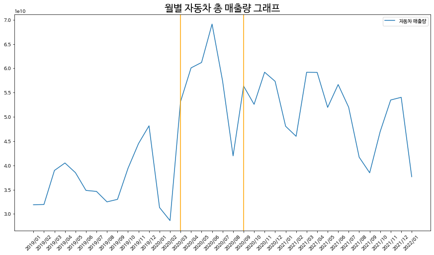

<br><br>

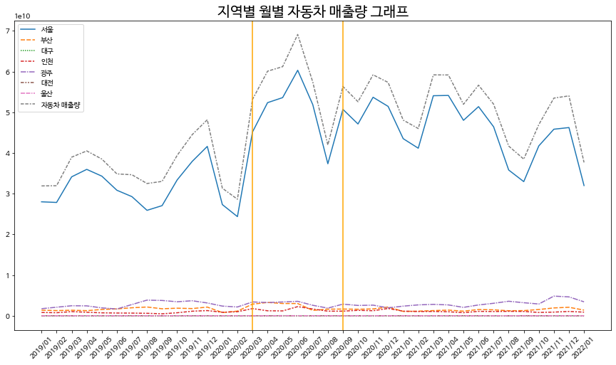

<br>

- 지역별 매출량과 총 매출량 모두 2020년 3월, 2020년 9월에 큰 증가폭을 보임
- 사회적 거리두기가 시행되기전인 2020년 3월 전보다 **대체로 매출량이 증가**함

<br><br><br>

**대중교통 이용량 변화**


2019/01 ~ 2022/01 동안의 지역별 대중교통(버스, 지하철) 이용량 시계열 그래프

<br>

- 사회적 거리두기가 시작된 **2020/03에 눈에 띄게 감소**
- 이후 증가하다가 **2020/08, 2020/09에 다시 감소**
  - 8.15 서울도심 집회 관련으로 집단감염 증가와 관련 있을 것으로 예상
- **2020/12에 눈에 띄게 감소**
  - 5인이상 집합 금지 등 사회적 거리두기 정책과 관련있을 것으로 예상

<br><br><br>

**전국 자동차 매출량 & 전국 대중교통 이용량 비교**

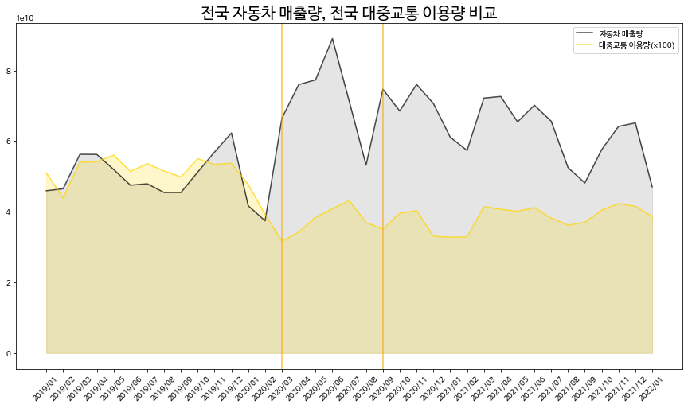

<br>

- 사회적 거리두기를 시작한 **2020/03을 기준**으로 **자동차 매출량은 급증**하고 **대중교통 이용랑은 급감**함
- **2020/09** 또한 **자동차 매출량**은 **증가**했고 **대중교통 이용량**은 **급감**함
  - 확진자 수가 급증했던 2020/08의 영향으로 예상
- 2020/03을 기준으로 자동차 매출량은 전보다 증가했고, 대중교통 이용량은 전보다 감소함

<br><br><br>

**사회적 거리두기 전후 대중교통 월평균 이용량 지역별 비교**

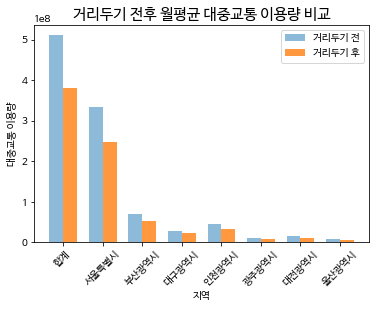

<br>

- **모든 지역에서 감소함**
- **서울, 부산, 인천 순**으로 **감소폭이 큼**
  - 인구 수와 관련있는 것으로 예상(2021년 6월 기준 한국 인구수 서울, 부산, 인천 순으로 多)

<br><br><br>

**사회적 거리두기 전후 대중교통 월평균 이용량 지역별 증감률**


월평균 거리두기 후 이용량 / 거리두기 전 이용량(2020/03 기준)

<br>

- **인천광역시, 대전광역시, 광주광역시 순**으로 **감소율이 큼**
  - 평소 사람들이 이용하는 이동수단 중 대중교통 비율이 컸을 것으로 예상
- **자동차 판매량**은 사회적 **거리두기가 시행되던 2020/3, 코로나 집단감염이 발생한 2020/9**에 눈에 띄게 **증가**하였다. 반면 **대중교통량**은 2020/3, 2020/9 시점에 **감소**했다.
- 2020/03을 기준으로, 자동차 판매량은 대체적으로 증가했고 대중교통량은 감소했다.
- 서울-부산-대구 순으로 대중교통 이용량 감소폭이 컸고, 인천-대전-광주 순으로 대중교통 이용량 감소율이 컸다. 이는 각각 인구 수, 이용하는 이동수단 비율의 영향으로 보인다.

<br><br><br>

### 분석을 통한 인사이트 도출

사회적 거리두기 시점 이후 자동차 매출량은 증가했고, 대중교통 이용량은 급감했다. 확진자 수 증가에 따른 코로나 전염에 대한 우려 때문인 것으로 예상된다. 또한 인구 수가 많을 수록 대중교통 이용량 감소폭이 컸고, 평소 이용하는 이동수단의 비율 중 대중교통이 차지하는 부분이 클 수록 대중교통 이용량 감소율이 컸다.

<br>

결론:  거리두기 on 시기(거리두기 시행)에 매출비중이 상위권을 차지하던 전자상거래(매출 1위 음식배달서비스), 자동차의 매출액은 늘었지만 그와 반대로 오프라인 음식점과 대중교통 매출액은 거리두기 시행후 감소하였다.

<br>

가설 검증 : 일부 일치하지만 거리두기로 인해 소비(카드 매출액)가 위축되었다고 하기는 어렵다.

<br><br><br>

<aside>
💡 가설5 : 거리두기 시행 이후 사람들의 정신건강도 악화되었을것이다.

<br>

### 데이터 수집

- 데이터 출처:
  - 보건의료빅데이터개방시스템의 정신건강검사결과 데이터 사용
  - 카카오데이터트렌드에서 제공하는 상대량 데이터 사용
    - json(크롤링) 형태로 수집해서 드라이브에 저장
- 데이터 수집 & 데이터 분석 시스템 구축: `Colab Notebook`
- 시각화 툴: `Matplotlib` - line plot, barh plot

<br>

### 분석결과

우울증 환자수 증가 추이

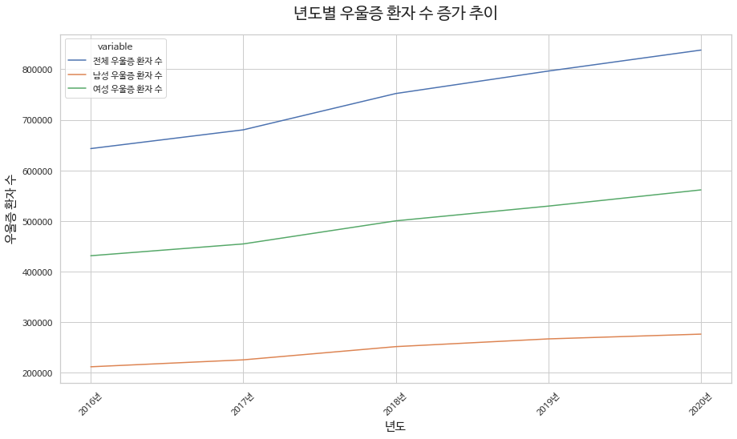

<br>

- **우울증 환자 수**는 **꾸준히 증가**하는 것을 확인할 수 있다.

- 남성 우울증 환자보다 **여성의 우울증 환자 수**가 **높다**.

  > 중앙 일보: 전문가들은 **여성들이 우울증에 더 잘 걸리는 이유를 여러가지로 해석**하고 있는데 여성의 생식 주기에 따른 호르몬의 변화, 소극적이고 비관적인 성격 상의 문제, 결혼과 육아의 이중 부담, 높은 빈도의 성적˙육체적 학대, 낮은 사회적 성취도, 사회적 지위 등을 대표적으로 꼽는다.

<br>

그렇다면 거리두기 시행 이후 우울함을 느끼는 사람들의 연령대가 달라졌을까?

<br><br>

거리두기 시행 여부에 따른 연령대별 우울증 환자수

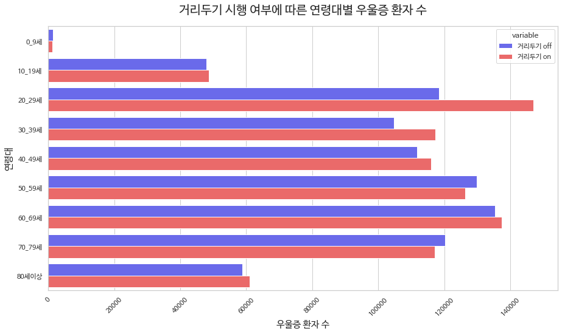

<br>

- **20대 우울증 환자 증가율**이 **높은 것을 확인**할 수 있다.

  > 백종우 경희대 의대 정신건강의학과 교수: “코로나19 사태 이후 20대 우울증 환자 급증은 한국뿐만 아니라 세계적으로 나타나는 현상”이라며 “다른 연령대와 달리 **미래가 불확실한 상황에서, 취업난·실직 위험·경제적 어려움** 등이 커진 것에 20대가 받는 정신적인 충격이 크다”라고 짚었다. 백종우 교수는 이어 “**한창 활동할 나이에 사회적 거리두기 등**에 따라 **주변 사람들과 교류가 적어지고, 여가·취미활동 등으로 스트레스를 풀 기회가 적어진 것도 한 원인**”이라며 “20대가 타인과 연결감을 느끼고, 자신은 보살핌을 받고 있다는 경험을 갖도록 맞춤형 지원을 할 필요가 있다”

<br>

가설 검증: 가설과 일치한다.

<br><br><br>

# 3. 프로젝트 후기 및 느낀점

**개인**

프로젝트 기간이 여유가 있다고 생각했는데 생각보다 촉박하게 느껴졌다. 원래 더 분석하려던 것이 있었는데 그거까지는 하지 못한 게 아쉽지만 프로젝트 주제나 흐름에 크게 영향을 미치는 건 아니어서 추가로 분석하려던 것은 빼고 분석을 마무리했다. 분석을 하면서 데이터 전처리는 하면 할수록 실력이 늘어난다는 것을 느꼈다. 프로젝트 초반에 했던 데이터 정제 코드하고 나중에 프로젝트 후반부에 했던 데이터 정제 코드를 비교해 보면 이건 이렇게 하면 더 쉽게 되는데 이때는 왜 이렇게 했지? 싶은 코드들이 있었다. 초반에 했던 코드를 지금보면 불필요해 보이는 코드들도 보이고 데이터 전처리 과정 자체가 매끄럽지 못했다는 것을 많이 느꼈다. 프로젝트 진행 중 분석에 쏟은 시간은 주말을 제외하면 4일 정도밖에 되지않는데 그 4일이 굉장히 값진 4일이었던 거 같다. 

<br>

한 달 전쯤 그동안 배운 것을 복습하기 위해 미니 프로젝트도 진행해 본 적이 있는데 혼자서 하려니 막막했고 시각화 프로젝트를 한 번도 해본 적이 없던지라 어떤 흐름으로 프로젝트를 끌어나가야 하는지도 잘 몰랐는데 이번 프로젝트를 진행하면서 어떤 흐름으로 내용을 전개해 나가야 하는지 많이 배울 수 있었다.

<br>

진행상의 어려움을 꼽자면 역시 시각화 부분이었다. 각 분석마다 시각화하기 적절한 그래프를 선정할 때 수업 시간에 배웠던 시각화 부분을 다시 복습하는 시간을 많이 가졌었다. 그러다 보니 수업 시간에 시각화를 배울 때는 bar plot 은 언제 쓰면 좋은지 line plot 은 언제 쓰면 좋은지 등등 그래프 각각의 용도나 쓰임새 까지는 깊이 생각을 못 했었는데 이번 프로젝트를 진행하면서 “이건 업종별로 각각의 평균 매출액을 확인해야 하는데 line plot보다는 bar plot 이 좋겠네.. 근데 업종이 10개 이상이니 bar plot보다는 수평 막대그래프인 barh plot을 쓰는 게 보기에 더 좋지 않을까 등등” 이와 같이 각 분석에 맞는 그래프를 선정하는 과정에서 여러 고민들을 하며 시각화 그래프에 대해 깊이 공부할 수 있던 시간이었다. 그리고 **시각화를 진행할 때 에러가 정말 많이 발생했었는데 그 에러들을 해결하기 위해 구글링도 열심히 하면서 또 공부가 되었다.**

<br>

그리고 또 진행상의 어려움을 꼽자면 하나의 데이터 안에서 여러 개의 분석 결과를 뽑아내는 게 생각보다 어려웠다. 데이터가 여러 개라면 각 데이터마다 비교하고 싶은 데이터들만 뽑아내서 상관관계를 분석한다거나 필요한 데이터들만 합쳐서 의미 있는 새로운 데이터를 뽑아낸다던가 여러 가지를 해볼 수 있었을 텐데 새로운 데이터를 수집해서 끌고 오기엔 프로젝트 주제에서 벗어날 거 같아 시도하지 못했다. 신용카드 매출 데이터만으로 해볼 수 있는 분석이 별로 없었던 게 아쉬웠다. 하지만 **한정된 데이터 안에서도 어떻게 유의미한 데이터를 뽑아낼 수 있는지 공부가 됐다.**

<br><br>

**팀**

초반에 각자 주제에 대한 아이디어나 분석에 대한 아이디어를 다양하게 얘기하는 회의 시간을 오래가졌었는데 모든 팀원이 적극적으로 참여해서 진행 흐름이 매끄럽게 흘러갈 수 있었다. 아이디어가 나올 때마다 해당 아이디어에 대한 각자의 의견을 덧붙이니 더 풍족하고 다양한 방향으로 프로젝트를 진행할 수 있었다. 팀원 간 소통의 경우도 슬랙이나 줌 채팅으로 원활히 진행되어 프로젝트를 잘 끝낸 것 같다.

---