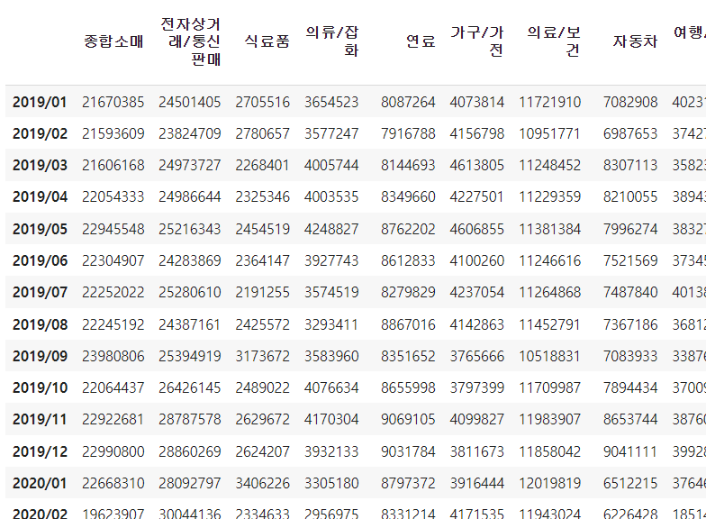
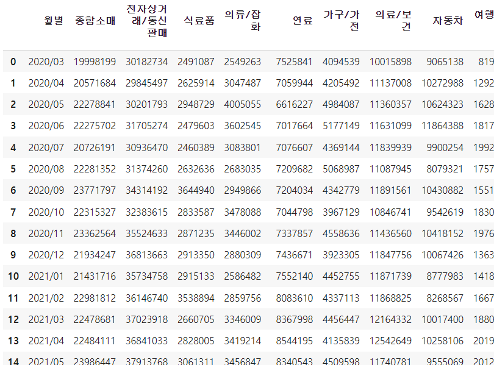

# 분석목표

- **목표: 거리두기 정책이 개인에게 미친 영향 분석하기**


- 기간설정: 거리두기 on VS 거리두기 off 비교

  - 거리두기 on 기간: 2020-02-29~2022-04-17

  - 거리두기 off 기간: 2019-01~ 2020-02-28 & 2022-04-18 ~


# 진행상황


# 1.데이터 불러오기


+ csv 파일을 불러온다.

```python
CREDIT_FILE = '/content/1신용카드 지역별_월간일평균_데이터(만원단위).csv'

import pandas as pd
import numpy as np

df = pd.read_csv(CREDIT_FILE, thousands=",",  encoding='euc-kr')
df.head()
```

인코딩 안해주면 데이터가 깨져서 나온다.


+ `info()` 한번 확인해주고

```python
df.info()
```

출력결과

```python
<class 'pandas.core.frame.DataFrame'>
RangeIndex: 547 entries, 0 to 546
Data columns (total 43 columns):
 #   Column   Non-Null Count  Dtype  
---  ------   --------------  -----  
 0   통계표      547 non-null    object 
 1   항목명1     544 non-null    object 
 2   항목명2     544 non-null    object 
 3   항목명3     544 non-null    object 
 4   단위       544 non-null    object 
 5   변환       544 non-null    object 
 6   2019/01  544 non-null    float64
 7   2019/02  544 non-null    float64
 8   2019/03  544 non-null    float64
 9   2019/04  544 non-null    float64
 10  2019/05  544 non-null    float64
 11  2019/06  544 non-null    float64
 12  2019/07  544 non-null    float64
 13  2019/08  544 non-null    float64
 14  2019/09  544 non-null    float64
 15  2019/10  544 non-null    float64
 16  2019/11  544 non-null    float64
 17  2019/12  544 non-null    float64
 18  2020/01  544 non-null    float64
 19  2020/02  544 non-null    float64
 20  2020/03  544 non-null    float64
 21  2020/04  544 non-null    float64
 22  2020/05  544 non-null    float64
 23  2020/06  544 non-null    float64
 24  2020/07  544 non-null    float64
 25  2020/08  544 non-null    float64
 26  2020/09  544 non-null    float64
 27  2020/10  544 non-null    float64
 28  2020/11  544 non-null    float64
 29  2020/12  544 non-null    float64
 30  2021/01  544 non-null    float64
 31  2021/02  544 non-null    float64
 32  2021/03  544 non-null    float64
 33  2021/04  544 non-null    float64
 34  2021/05  544 non-null    float64
 35  2021/06  544 non-null    float64
 36  2021/07  544 non-null    float64
 37  2021/08  544 non-null    float64
 38  2021/09  544 non-null    float64
 39  2021/10  544 non-null    float64
 40  2021/11  544 non-null    float64
 41  2021/12  544 non-null    float64
 42  2022/01  544 non-null    float64
dtypes: float64(37), object(6)
memory usage: 183.9+ KB
```

첫번째 컬럼빼고는 모두 3개씩의 NaN 값이 있는걸로 봐선 3개의 행 전체가 NaN 값일 확률이 높을것같다 -> NaN 값 처리해준다.


# 2.데이터 다듬기


+ 필요없는 컬럼 삭제

```python
del df['통계표']
del df['단위']
del df['항목명3']
del df['변환']
```


+ NaN 값 위치확인

```python
df.isnull()
```

출력결과

```python
542	False	False	False	False	False	...	False	
543	False	False	False	False	False	...	False	
544	True	True	True	True	True	...	True	
545	True	True	True	True	True	...	True	
546	True	True	True	True	True	...	True
547 rows × 39 columns
```

예상대로 맨 밑에 위치항 행 3개가 전부 NaN 으로 채워진 행이였다.


+ 결측값이 있는 행 3개 제거

```python
df = df.dropna()
```


+ 컬럼명 변경

```python
df = df.rename(
    columns={
        '항목명1' : '지역',
        '항목명2' : '업종명'
    }
)
```


+ 타입캐스팅 : 숫자데이터 float -> int 로 변경

월별 컬럼들의 필드 데이터타입이 `float` 형태인데 사용하기좋게 `int` 형태로 바꾼다.

```python
df.iloc[:,2:39] = df.iloc[:, 2:39].astype(int)
df.info()
```

출력결과

```python
<class 'pandas.core.frame.DataFrame'>
Int64Index: 544 entries, 0 to 543
Data columns (total 39 columns):
 #   Column   Non-Null Count  Dtype 
---  ------   --------------  ----- 
 0   지역       544 non-null    object
 1   업종명      544 non-null    object
 2   2019/01  544 non-null    int64 
 3   2019/02  544 non-null    int64 
 4   2019/03  544 non-null    int64 
 5   2019/04  544 non-null    int64 
 6   2019/05  544 non-null    int64 
 7   2019/06  544 non-null    int64 
 8   2019/07  544 non-null    int64 
 9   2019/08  544 non-null    int64 
 10  2019/09  544 non-null    int64 
 11  2019/10  544 non-null    int64 
 12  2019/11  544 non-null    int64 
 13  2019/12  544 non-null    int64 
 14  2020/01  544 non-null    int64 
 15  2020/02  544 non-null    int64 
 16  2020/03  544 non-null    int64 
 17  2020/04  544 non-null    int64 
 18  2020/05  544 non-null    int64 
 19  2020/06  544 non-null    int64 
 20  2020/07  544 non-null    int64 
 21  2020/08  544 non-null    int64 
 22  2020/09  544 non-null    int64 
 23  2020/10  544 non-null    int64 
 24  2020/11  544 non-null    int64 
 25  2020/12  544 non-null    int64 
 26  2021/01  544 non-null    int64 
 27  2021/02  544 non-null    int64 
 28  2021/03  544 non-null    int64 
 29  2021/04  544 non-null    int64 
 30  2021/05  544 non-null    int64 
 31  2021/06  544 non-null    int64 
 32  2021/07  544 non-null    int64 
 33  2021/08  544 non-null    int64 
 34  2021/09  544 non-null    int64 
 35  2021/10  544 non-null    int64 
 36  2021/11  544 non-null    int64 
 37  2021/12  544 non-null    int64 
 38  2022/01  544 non-null    int64 
dtypes: int64(37), object(2)
memory usage: 170.0+ KB
```


+ 혹시 모르니 원본데이터 그대로 쓰지말고 복사해서 쓰자

```python
# 데이터 프레임 복사
credit_df = df.copy()
```


+ 거리두기 on과 off를 각각 따로 나눠서 저장

```python
# 거리두기 on 기간: 2020-02-29~2022-04-17 -> 2020.03 부터 2022.01로 정제
# 거리두기 off 기간: 2019-01~ 2020-02-28 & 2022-04-18 ~ -> 2019.01 부터 2020.02로 정제

# 거리두기 on 데이터프레임
on1_df = credit_df.iloc[:,16:]
on2_df = credit_df['지역']
on3_df = credit_df['업종명']
on_df = pd.concat([on2_df, on3_df], axis=1)
on_df = pd.concat([on_df, on1_df], axis=1)

# 거리두기 off 데이터프레임
off1_df = credit_df.iloc[:,2:16]
off2_df = credit_df['지역']
off3_df = credit_df['업종명']
off_df = pd.concat([off2_df,off3_df], axis=1)
off_df = pd.concat([off_df, off1_df], axis=1)

off_df.head()
```


# 3.분석 및 시각화

## 초기셋팅

```python
# #한글깨짐 방지 코드
# !sudo apt-get install -y fonts-nanum
# !sudo fc-cache -fv
# !rm ~/.cache/matplotlib -rf
```

```python
import matplotlib.pyplot as plt
plt.rc('font', family='NanumBarunGothic') 
import matplotlib.ticker as ticker
import seaborn as sns 
sns.set()   # plt 로 그려도 자동으로 sns 를 쓸수있게해주는 코드

%config InlineBackend.figure_format = 'retina' #그래프 화질 높이기
```


## 분석1

> 주제: 월 별 매출 변화율 분석
>
> 해야되는 작업 : 거리두기 on 과 거리두기 off 를 모두 합쳐서 월 별 전체 매출액 확인
>
> 이 분석을 하는 이유: 신용카드 매출액이 갈수록 증가하는 형태인지 하락하는 형태인지를 분석하기위함. 또한 그래프에서 매출액 하락이 나타나는 구간은 어디인지, 하락이나 증가가 일어났다면 왜그런지 예측을 해보기위함.


+ 업종별 합계만 집계 

업종명이 합계인 데이터만 찾기위해 조건마스크를 써준다.

```python
mask = credit_df['업종명'] =='합계'
df1 = credit_df[mask]
```

출력결과


### 시각화 전 데이터 정제

+ 방법 1 (간단한 방법)

```python
# 테스트
df1.iloc[:,2:].sum().index[:] 

# 같은 결과가 나오는 코드들
# df1.iloc[:,2:].columns[:] 
# df1.columns[2:]
```

출력결과

```python
Index(['2019/01', '2019/02', '2019/03', '2019/04', '2019/05', '2019/06',
       '2019/07', '2019/08', '2019/09', '2019/10', '2019/11', '2019/12',
       '2020/01', '2020/02', '2020/03', '2020/04', '2020/05', '2020/06',
       '2020/07', '2020/08', '2020/09', '2020/10', '2020/11', '2020/12',
       '2021/01', '2021/02', '2021/03', '2021/04', '2021/05', '2021/06',
       '2021/07', '2021/08', '2021/09', '2021/10', '2021/11', '2021/12',
       '2022/01'],
      dtype='object')
```


### 시각화

```python
# 시각화 - plot : lineplot     
plt.rc('font', family='NanumBarunGothic') #위에 초기세팅할때 집어넣었는데도 시각화 할때마다 안치면 한글깨짐...

plt.figure(figsize=(15,8))
plt.plot(df1.iloc[:,2:].sum().index[:],df1.iloc[:,2:].sum())

plt.xlabel('월별')
plt.ylabel('매출액')
plt.title('총 매출액 변화율')

plt.xticks(rotation=45)

plt.grid()
plt.show()
```

출력결과

.png)

- 방법2 (for문 이용)

```python
# 테스트 - 2019/01 의 전국 소비량 합계
df1['2019/01'].sum()
```

출력결과

```python
144955073
```


```python
month_data=[]
sum_data=[]

for i in df1.iloc[:,2:]:
  month_data.append(i)
  sum_data.append(df1[i].sum())
  #print(i)
sum_data
```

출력결과 (print(i) 하면 나오는 결과)

```python
2019/01
2019/02
2019/03
2019/04
2019/05
2019/06
2019/07
2019/08
2019/09
2019/10
2019/11
2019/12
2020/01
2020/02
2020/03
2020/04
2020/05
2020/06
2020/07
2020/08
2020/09
2020/10
2020/11
2020/12
2021/01
2021/02
2021/03
2021/04
2021/05
2021/06
2021/07
2021/08
2021/09
2021/10
2021/11
2021/12
2022/01
```

출력결과(sum_data 출력시)

```python
[144955073,
 139006312,
 143538310,
 145304111,
 148739569,
 145315149,
 149069740,
 146048559,
 146404890,
 150319666,
 155810305,
 156153444,
 152688838,
 142296865,
 135213776,
 143554038,
 151353147,
 154641223,
 154213378,
 149603973,
 157094464,
 152594192,
 158935840,
 151231481,
 149252506,
 157226566,
 160869288,
 163234932,
 165224394,
 167366371,
 169623489,
 161535693,
 169034897,
 172482634,
 179424593,
 174172606,
 175933845]
```

sum_data 라는 빈 리스트에 `append`로 추가시키면서 결과를 담았기에 리스트 형태로 나온다.


```python
# 결과가 잘 나왔나 테스트
# 2019/01~ 2022/01 까지 월 갯수는 37개니까 len(sum_data) 가 37 로 나오면됨.
len(sum_data)
```

출력결과

```python
37
```


++ 또 다른 방법

```python

```


```python
for i in df1.columns[2:]:
  t = df1[i].sum().to_list()  # t = list(df1[i].sum()) 얘도 안됨.
```

에러화면

```python
---------------------------------------------------------------------------
AttributeError                            Traceback (most recent call last)
<ipython-input-160-b68bc680d577> in <module>()
      1 for i in df1.columns[2:]:
----> 2   t = df1[i].sum().to_list()
      3 t

AttributeError: 'numpy.int64' object has no attribute 'to_list'
```


### 분석

+ 결과 분석

  .png)

  + 거리두기 첫 시행기간(2020-02-29~)에 전국적으로 매출액이 대폭 하락했음. 
  +  카드 매출액이 시간이 갈수록 높아지고 있다
    + 점점 온라인 배달주문 시스템이 확장됨에 따라 집에서도 편하게 무엇이든 주문이 가능해졌다. ex) 거리두기 시행의 여파로 손님확보를 위해 전통시장에서도 배달서비스를 시작했음.
    + 직접 매장을 방문하여 오프라인(ex.시장)에서 현금을 많이 사용하던 사람도 거리두기로 인해 집에서 온라인쇼핑이나 앱으로 물건이나 음식을 주문후 배달받는 경우가 많아짐에 따라 현금보다 카드 사용률이 증가했을것으로 생각됨.
  + 2021-07 ~ 2021-08 기간에 소비율 하락을 보이는 이유
  + 제일 peak 를 찍은 2021-10 ~ 2021-11 월은 상생소비지원금 시행기간이였다. 그에따른 소비자들의 카드사용액 증가로 보여짐.
    + 상생소비지원금 
      + 지역경제 활성화와 소비회복 촉진을 위해 신용 또는 체크카드를 2분기 월평균 사용액보다 3% 많이 쓰면, 3%를 넘는 증가분의 10%를 1인당 월 10만원까지 현금성 충전금으로 환급해 주는 사업


## 분석2

> 큰 업종별로 나눠서 매출변화율 확인

```markdown
업종분류
1.종합소매(5)
  : 백화점, 대형마트/ 유통전문점, 슈퍼마켓, 편의점, 면세점
2.전자상거래/ 통신판매
3.식료품(2)
  : 일반식료품, 건강보조식품
4.의류/잡화(4)
  : 의복/직물, 복식잡화, 시계/귀금속/안경, 화장품
5.연료
6.가구/ 가전(2)
 : 가구, 가전제품/정보통신기기
7.의료/보건(2)
  : 종합병원, 일반병의원/기타의료기관
8.자동차(3)
  : 국산자동차신품, 기타운송수단, 자동차부품 및 정비
9.여행/교통(3)
  : 여행사/자동차임대, 항공사, 대중교통
10.오락/문화(2)
  : 스포츠/오락/여가, 서적/문구
11.교육
12.숙박/음식(2)
  : 숙박, 음식점
13.공과금/개인 및 전문 서비스
14.금융/보험
15.기타
```


### 데이터정제

+ 업종이 다 합쳐진 합계는 빼고서 작업한다.

```python
# 업종명에서 합계소비는 빼고 확인 (서울의 경우 0번 행에 합계가 있었음)
mask = credit_df['업종명'] != '합계'
df2 = credit_df[mask]
df2.head(3) 
```

출력결과


업종별로 매출변화를 확인할꺼니까 지역별로 업종이 합쳐져있는 합계행은 제외해준다.


+ 세분화된 업종을 하나로 묶기

ex) 백화점, 대형마트/유통전문점, 슈퍼마켓, 편의점, 면세점 -> <u>'종합소매'</u> 로 묶기

```python
df2 = df2.groupby('업종명').sum()

df2_1 = pd.Series(df2.iloc[[6,7,8,12,-9]].sum(), name='종합소매')
df2_2 = pd.Series(df2.iloc[-1])
df2_3 = pd.Series(df2.iloc[[2,-12]].sum(), name='식료품')
df2_4 = pd.Series(df2.iloc[[9,14,17,-7]].sum(), name='의류/잡화')
df2_5 = pd.Series(df2.iloc[-2])
df2_6 = pd.Series(df2.iloc[:2].sum(), name='가구/가전')
df2_7 = pd.Series(df2.iloc[[-10,-13]].sum(), name='의료/보건')
df2_8 = pd.Series(df2.iloc[[3,4,-11]].sum(), name='자동차')
df2_9 = pd.Series(df2.iloc[[5,15,-8]].sum(), name='여행/교통')
df2_10 = pd.Series(df2.iloc[[10,13]].sum(), name='오락/문화')
df2_11 = pd.Series(df2.iloc[-5])
df2_12 = pd.Series(df2.iloc[[11,-15]].sum(), name='숙박/음식')
df2_13 = pd.Series(df2.iloc[-6])
df2_14 = pd.Series(df2.iloc[-4])
df2_15 = pd.Series(df2.iloc[-3])

# 시리즈 병합
df2_sum = pd.merge(df2_1,df2_2,left_index = True, right_index = True)
df2_sum = pd.merge( df2_sum,df2_3 ,left_index = True, right_index = True)
df2_sum = pd.merge( df2_sum,df2_4 ,left_index = True, right_index = True)
df2_sum = pd.merge( df2_sum,df2_5 ,left_index = True, right_index = True)
df2_sum = pd.merge( df2_sum,df2_6 ,left_index = True, right_index = True)
df2_sum = pd.merge( df2_sum,df2_7 ,left_index = True, right_index = True)
df2_sum = pd.merge( df2_sum,df2_8 ,left_index = True, right_index = True)
df2_sum = pd.merge( df2_sum,df2_9 ,left_index = True, right_index = True)
df2_sum = pd.merge( df2_sum,df2_10 ,left_index = True, right_index = True)
df2_sum = pd.merge( df2_sum,df2_11 ,left_index = True, right_index = True)
df2_sum = pd.merge( df2_sum,df2_12 ,left_index = True, right_index = True)
df2_sum = pd.merge( df2_sum,df2_13 ,left_index = True, right_index = True)
df2_sum = pd.merge( df2_sum,df2_14 ,left_index = True, right_index = True)
df2_sum = pd.merge( df2_sum,df2_15 ,left_index = True, right_index = True)
df2_sum
```

출력결과




++ 업종이 세분화되어있지않은 업종 (ex) 교육 이나 전자상거래/통신판매 ) 들 정리할때

방법1: 그냥 가져오기 (어차피 자신의 카테고리에 자기밖에 없으니 자기자신을 가져와서 합쳐주면 되는것)

```python
df2.iloc[-1]  # 이렇게 사용했다.
```


방법2: sum 함수 사용하여 가져오기

```python
df2.iloc[[-1]].sum()
```

: 방법1과 방법2의 데이터 출력결과는 비슷하나 sum 함수를 사용하는 경우 시리즈의 이름이 없어지기에 다시 재지정해줘야한다. `pd.Series( , name=' ')` 

단일업종의 이름을 바꾸고싶은경우에 방법2를 쓰면된다.


*++ 깨달은것 : **시리즈도 병합이 가능함***

병합은 데이터프레임만 되는줄 알았고 시리즈 의 병합은 생각을 못하고 있었는데 이번에 세분화된 업종을 하나로 합쳐주는 작업을 하면서 시리즈는 병합이 안되나 찾던중 시리즈도 병합이 된다는 점을 알게되었다!!! 게다가 데이터프레임을 병합하는 함수들(`concat` ,`merge`)중  `merge` 함수를 사용하여 병합하는데 파라미터만 조금 다르고 매우 비슷하다.

```python
df2_sum = pd.merge(df2_1,df2_2,left_index = True, right_index = True) # 시리즈 병합시 코드
df2_sum = pd.merge(df2_1,df2_2,on='월별',how='left') # 데이터프레임 병합시 코드
```

저렇게 시리즈들을 병합해주면 데이터프레임이 된다.


+ 지금 월별 컬럼이 행 인덱스로 되어있으니 정리해준다.

```python
# 월별 컬럼 추가해주기
df2_sum = df2_sum.reset_index()
df2_sum.rename(columns={'index' : '월별'}, inplace=True)
df2_sum
```

출력결과


+ 거리두기 on 시기와 거리두기 off 시기로 쪼개준다.

  (사실 안쪼개도 상관없으나 다른거 분석할때 필요할수도 있으니 쪼개주고 새로운 변수에 할당해 준다. 거리두기 on/off 로 안쪼개진 원본도 사용할수있게)

  ```python
  # 거리두기 on 과 거리두기 off 로 쪼개기
  
  # 거리두기 on
  df2 = df2_sum
  df2_on = df2[df2['월별'] > '2020/02'].reset_index(drop=True)
  
  # 거리두기 off
  df2_off = df2[df2['월별'] <= '2020/02']
  
  df2_on
  ```

  출력결과

  

  

  df2_sum 의 작업은 끝났으니 df2 에 할당해준다.

  

  + reset_index

```python
reset_index() #행 인덱스가 필드로 들어온다. 대신 컬럼명은 'index'로 자동지정되니 컬럼명 변경해줄것
reset_index(drop=True) # (필드명으로 된) 행인덱스가 없어지거나 기본인덱스 순번을 재지정해준다.
```


++ 리스트는 replace 를 사용할수없다.

```python
a=['2019/01','2019/02','2019/03']
a.replace('/','.') # 될거같지만 안된다... for 문을 사용해서 리스트의 인덱스(순번)를 이용해 바꾸는건 가능함.
```


+ **pie chart 옵션**

  - explode: 파이에서 툭 튀어져 나온 비율
  - autopct: 퍼센트 자동으로 표기

  - shadow: 그림자 표시

  - startangle: 파이를 그리기 시작할 각도
  - texts : label에 대한 텍스트 효과
  - autotexts : 파이 위에 그려지는 텍스트 효과를 다를 때 사용
    - texts, autotexts 인자를 파이차트를 그리면 리턴 받습니다.


+ 파이차트가 찌그러져 나오면

```python
plt.axis('equal')
```

위 코드를 실행하면 동그랗게 만들수있다.


